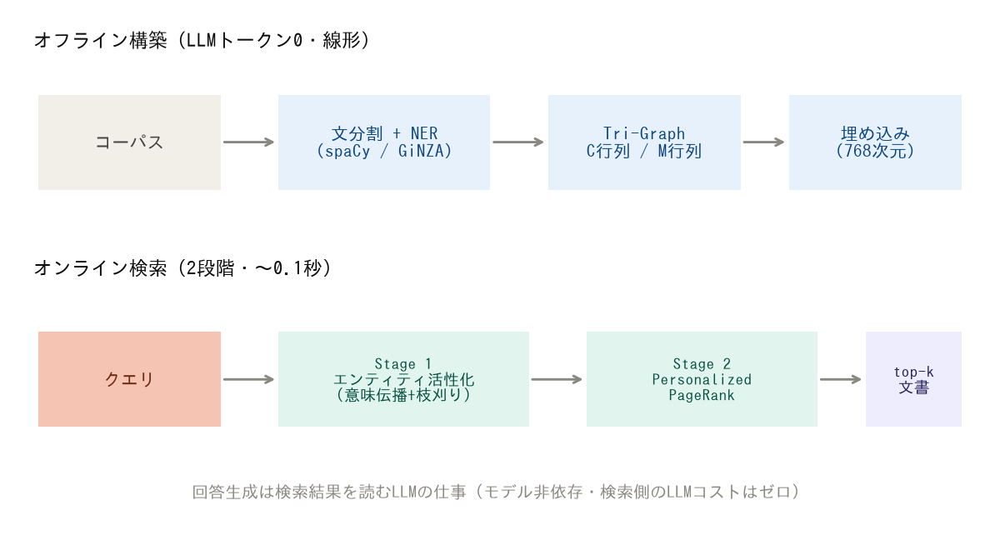
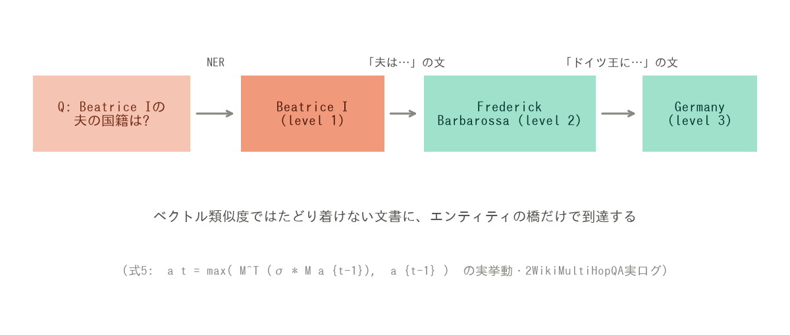
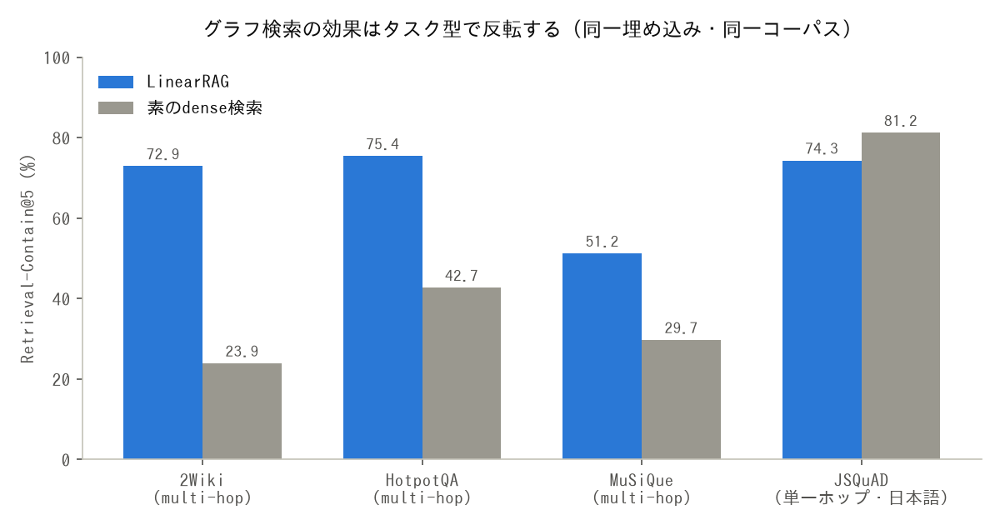
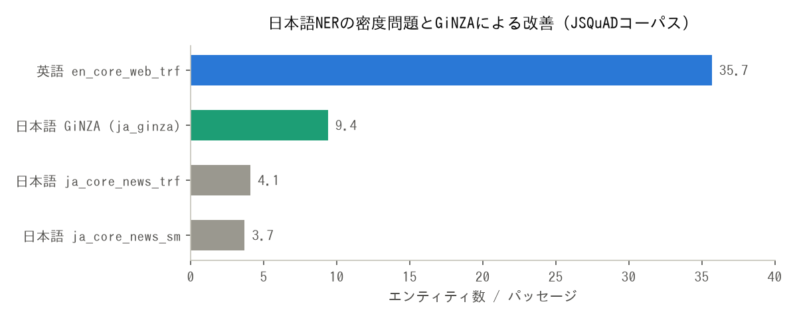
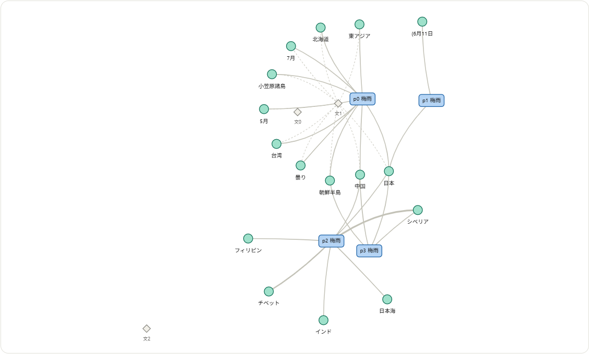
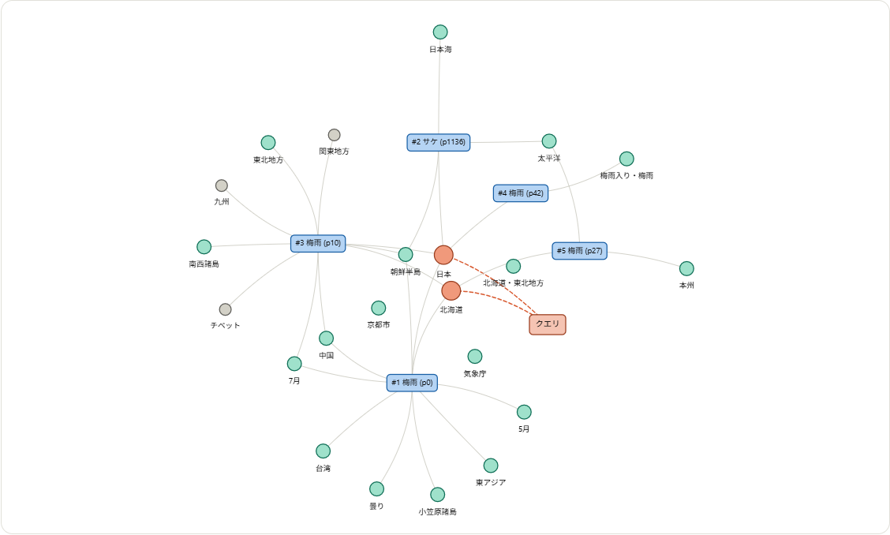

<!--
Qiita投稿用ドラフト
タグ候補: RAG, GraphRAG, LLM, ClaudeCode, 自然言語処理
-->

# LLMトークン0円でグラフRAGを作る — 論文「LinearRAG」をClaude Codeスキルとして完全実装して、論文同水準の検索性能を確認するまで

## TL;DR

- グラフRAGの弱点である「LLMによる関係抽出」を**丸ごと捨てる**論文 LinearRAG（arXiv:2510.10114）を、論文の数式だけからクリーンルーム実装した
- 索引構築のLLMトークン消費は**ゼロ**。658文書の索引が**GPUで124秒**、検索は**0.14秒/クエリ**
- 論文が使った4データセット全部で評価し、2WikiMultiHopQAで**論文と同水準（72.9% vs 論文70.2%）**を確認
- 素のベクトル検索と比べると、**multi-hop質問で2〜3倍、単一ホップでは逆に負ける**——グラフRAGの使いどころが数字ではっきり見えた
- 日本語（JSQuAD）でも動かした。spaCy標準モデルのNERが英語の1/10しか取れない問題に当たり、**GiNZAで密度2.5倍**まで持っていった
- 日本語唯一の本格multi-hopデータセット**JEMHopQA**でも検証し、**日本語でもグラフ検索がdenseの1.6倍**になることを確認した
- 実装はClaude Codeの**スキル**（`SKILL.md`＋Pythonスクリプト3本）として公開: https://github.com/nahrun1682/LinearRAG-Skill

---

## 1. なぜLinearRAGか — 「関係抽出、それ本当に要る？」

GraphRAG系の手法は、multi-hop質問（「Beatrice Iの**夫**の**国籍**は？」みたいに複数文書をまたぐやつ）に強いとされる一方、実運用では**naive RAGに負ける**という報告が相次いでいます。

原因としてLinearRAGの著者らが指摘するのが、グラフ構築時の**関係抽出（OpenIE）の品質**です。

- 局所的な誤り: 「アインシュタインは相対性理論では**ノーベル賞を取っていない**」→ `(アインシュタイン, ノーベル賞受賞, 相対性理論)` と否定が消える
- 大域的な不整合: 文書ごとに独立に抽出するので、コーパス全体で三つ組が矛盾する
- そして何より**高い**。LLMで全文書を舐めるので、LightRAGだと2Wikiの実験全体（索引＋検索）でpromptトークン35M超・completion 51M超（論文Table 2）

LinearRAGの答えは過激で、**関係を抽出しない**。

> 文書をまたいで情報をつなぐ主役は「関係」ではなく「エンティティの一致」であり、関係の意味は三つ組に圧縮せず原文に残して、読むのは推論時のLLMに任せればいい

グラフには関係ラベル付きエッジが存在せず、あるのは3種類のノード（passage / sentence / entity）と2つの疎行列だけです。

```text
Tri-Graph:
  C行列 (passage × entity):  パッセージpがエンティティeを含むか
  M行列 (sentence × entity): 文sがエンティティeに言及するか (0/1)
```

（論文の式1・2ではどちらも二値の指示関数。ただし後段の式7がエンティティの出現回数 N_pi を使うため、実装ではCを出現回数で保持し、使う場面で二値化しています）

構築に必要なのは文分割とNER（spaCy）だけ。**LLM呼び出しゼロ、コーパスサイズに線形**です。



## 2. 検索は2段階 — 「橋を渡してから、街の重要度を測る」

### Stage 1: エンティティ活性化（意味の橋渡し）

クエリのエンティティを種として、文×エンティティの二部グラフ上で活性を伝播させます。論文の式5がこれ:

```math
a_t = \max\left(M^\top(\sigma_q \odot (M a_{t-1})),\ a_{t-1}\right)
```

日本語にすると「**活性エンティティを含む文のうち、クエリに意味的に近い文にいる他のエンティティへ、活性が染み出す**」。実装は疎行列演算3回とmaxだけです:

```python
for it in range(2, max_iterations + 2):
    spread = M.T @ (sigma * (M @ a))     # 文経由で隣のエンティティへ
    updated = np.maximum(a, spread)
    newly = (levels == 0) & (updated >= delta)   # 動的枝刈り
    ...
```

これが効く実例として、論文（Table 7のケーススタディ）は次の連鎖を示しています:

```text
Q: What nationality is Beatrice I's husband?
  hop 0: Beatrice I           ← クエリ直結
  hop 1: Frederick Barbarossa ← 「Beatriceの夫は…」の文経由で活性化
  hop 2: Germany              ← 「Frederickはドイツ王に…」の文経由で活性化
```



クエリと**意味的に全く似ていない**「ドイツ」の文書に、エンティティの橋だけでたどり着きます。ベクトル検索には原理的にできない芸当です。

なお私の再現実装で同じクエリを実行すると、活性化の**経路**は論文と同一にはなりません（枝刈り閾値などの設定が違うため、Burgundy系のエンティティが活性化されます）。それでも正解「Germany」を含むパッセージはrank 1で返ってきました——特定の連鎖に依存せず、活性化された近傍＋PageRankの合わせ技で正解に到達するのがこの手法の頑健さです。日本語での本物の活性化ログは後半の可視化セクションでお見せします。

### Stage 2: Personalized PageRank（大域的な重要度）

Stage 1の活性値をシードに、passage×entityの二部グラフでPPRを回して、上位k件のパッセージを返します。回答生成はしません——**そこはスキルを呼んだClaude本人の仕事**、という設計です（だから検索側のLLMコストもゼロ）。

## 3. Claude Codeスキルとしての実装

```text
.claude/skills/linearrag/
├── SKILL.md            # トリガー条件と使い方（Claudeが読む）
└── scripts/
    ├── build_graph.py  # 索引構築CLI
    ├── query_graph.py  # 2段階検索CLI（JSONを返す）
    └── evaluate.py     # バッチ評価CLI
```

こだわった点:

- **クリーンルーム実装**: 公式実装のコードは見ても使わない。論文の式1〜7から書き起こし、公式からはハイパーパラメータの意味と値だけを事実情報として参照（ライセンス面の配慮）
- **PEP 723 + uv**: 各スクリプト先頭のインラインメタデータで依存を宣言。`uv run` だけで環境が立ち上がる。リポジトリ本体は依存ゼロ
- **遅延import設計**: spaCy/sentence-transformersは関数内import。おかげでユニットテスト47本はnumpy/scipyだけで0.2秒で回る
- **TDD**: 式5の伝播は「2-hopで橋渡しエンティティが活性化する合成グラフ」を手計算で検算してからテストを書いた

## 4. 論文の全データセットで検証する

論文が使った4つのデータセット（HotpotQA / 2WikiMultiHopQA / MuSiQue / Medical）＋日本語のJSQuADで、索引構築→検索評価を全部回しました。

| データセット | 索引構築(GPU) | Retrieval-Contain@5 | 論文のContain-Acc |
|---|---|---|---|
| 2WikiMultiHopQA | 124秒 | **72.9%** | 70.2% |
| HotpotQA | 562秒 | **75.4%** | 64.3% |
| MuSiQue | 536秒 | **51.2%** | 33.9% |
| Medical | 57秒 | （※） | GPT-Accのみ |

:::note warn
指標に注意。論文のContain-Accは「**生成した回答**に正解が含まれるか」、こちらのRetrieval-Contain@5は「**検索したtop-5パッセージ**に正解文字列が含まれるか」で、後者は前者の上限側に出ます。「HotpotQA 75.4 > 64.3だから論文超え」ではなく「生成精度を成立させるのに十分な検索品質」と読むのが正しいです。2Wikiの72.9% vs 70.2%は同水準と言ってよい範囲でした。

※Medicalは正解が長い記述文で文字列一致が原理的に効かないため、論文もGPT評価のみ使用（実測でもContain@5は0.4%となり、この指標が機能しないことを確認済み）。
:::

### 一番面白かった実験: 素のベクトル検索との直接対決

同じ埋め込みモデル・同じコーパスで「cos類似度top-5だけ」のベースラインと比較しました。

| データセット | 素のdense検索 | LinearRAG | 差 |
|---|---|---|---|
| 2Wiki (multi-hop) | 23.9% | **72.9%** | **+49.0pt（3.1倍）** |
| HotpotQA (multi-hop) | 42.7% | **75.4%** | +32.7pt |
| MuSiQue (multi-hop) | 29.7% | **51.2%** | +21.5pt |
| JSQuAD (単一ホップ) | **81.2%** | 74.3% | **−6.9pt** |



**multi-hopでは圧勝、単一ホップでは負ける。** 質問と正解文書が語彙的に近い単一ホップQAではベクトル検索がほぼ最適で、グラフの重み付けは介入するほどノイズになります。グラフRAGを「入れるべきか」の判断基準が、この4行に凝縮されています。

## 5. 日本語で動かしたら、NERが壁だった

JSQuAD（1,145パッセージ・4,442問）に言語自動判定＋spaCy日本語モデルで挑んだところ、パイプラインは無修正で動いたものの:

| | エンティティ/パッセージ | クエリでエンティティ0個の率 |
|---|---|---|
| 英語 en_core_web_trf | 35.7個 | — |
| 日本語 ja_core_news_sm | **3.7個** | **40%** |
| 日本語 ja_core_news_trf | 4.1個 | — |

日本語標準モデルのNEアノテーションは英語の**約1/10**。しかもTransformer版にしても+10%しか増えません（学習データのアノテーション自体が疎）。グラフの背骨がスカスカでは橋渡しのしようがない。



そこで**GiNZA**（関根拡張固有表現・約200カテゴリ）を組み込んだところ:

- エンティティ密度 3.7 → **9.4個/パッセージ（2.5倍）**
- クエリのエンティティ0個率 40% → **20%**
- smが完全に取りこぼしていた「梅雨」のようなトピック語も拾える

ただしGiNZAは最新spaCyとの互換問題（`split_mode: None`が設定バリデーションで弾かれる）があり、ロード時の設定上書きが必要でした:

```python
spacy.load("ja_ginza", config={
    "components": {"compound_splitter": {"split_mode": "C"}}})
```

### 日本語でもmulti-hopならグラフが勝つのか？ — JEMHopQAで検証

JSQuADは単一ホップなので、「multi-hopでの優位」が日本語でも成立するかは別の検証が必要です。日本語で唯一の本格multi-hop QAデータセット **JEMHopQA**（理研・NII、CC BY-SA 4.0）のdev 120問で試しました。根拠が `[エンティティ, 属性, 値]` の三つ組で付いている、2WikiMultiHopQAの日本語版のようなデータセットです。

コーパスは同梱されないので、各問題の根拠記事（219記事）をWikipedia APIから取得して3,578パッセージに分割し、GiNZA索引を構築。同一条件で素のdense検索と比較しました:

| 区分 | n | LinearRAG | 素のdense | 倍率 |
|---|---|---|---|---|
| 実質評価可能（YES/NO答を除く） | 75 | **49.3%** | 30.7% | **1.6倍** |
| 　比較型（「AとB、早いのは？」） | 28 | **78.6%** | 46.4% | 1.7倍 |
| 　合成型（「Aの夫の国籍は？」） | 47 | 31.9% | 21.3% | 1.5倍 |

**日本語でもmulti-hopならグラフが1.5〜1.7倍**。英語の2Wiki（3.1倍）ほど劇的ではないものの、方向は完全に一貫しています。GiNZAで整備したエンティティ密度（この索引では25.6個/パッセージ）がグラフの背骨として機能した証拠でもあり、JSQuADで負けてJEMHopQAで勝つ——という対比が「グラフRAGは連想が必要なときだけ効く」という本記事の結論をそのまま裏書きしてくれました。

注意点も正直に：答えが「YES/NO」の45問はContain指標では測れないため除外しています。また正解は2021年のWikipedia由来なのに対しコーパスは2026年時点の本文なので、時間依存の7問はほぼ全滅でした（時点ズレ）。

## 6. ハマりどころ供養

実装中に踏んだ地雷たち。誰かの検索に引っかかりますように。

**WSLのOOMキラーに沈黙して殺される** — spaCy Transformerモデルの`nlp.pipe(batch_size=32)`が長文パッセージでメモリを食い尽くし、ログも吐かず消えた。`dmesg`で`Out of memory: Killed process`を発見。Transformerパイプラインはバッチを小さく（自動判定で4に）。

**cupyが「CuPy is not installed」と言い張る** — 実際はインストール済み。真因はcupyがdlopenする`libcublas.so.12`が見つからないこと。torchが同梱するNVIDIAライブラリは`site-packages/nvidia/*/lib`にいるが、ローダのパスに乗っていない。しかも`LD_LIBRARY_PATH`はプロセス起動後に変えても効かない。解決策は**ctypesでRTLD_GLOBAL事前ロード**:

```python
for lib in glob.glob(f"{site_packages}/nvidia/*/lib/*.so*"):
    ctypes.CDLL(lib, mode=ctypes.RTLD_GLOBAL)
```

さらに罠: このプリロードは`import spacy`**より前**に実行しないと無意味（thincはspaCyのimport時にcupyを検査する）。これでspaCy trf NERがGPUで動き、索引構築が**937秒→124秒（7.6倍）**に。

**索引の上書き保存でデータロス** — `shutil.rmtree(old)`→`os.replace(new)`の間に落ちると新旧両方消える。旧索引を`.bak`にリネーム退避→スワップ→成功時に削除、失敗時に復元、の3段階に。コードレビュー（サブエージェント）に指摘されて直した。

**二部グラフのPageRankが振動する** — 二部グラフは周期2を持つのでべき乗法が発振し得る。reset項`(1-d)·r`が毎回混ざるので実際は収束するが、damping>0.7あたりからmax_iter内に収束しないことがあり、**警告なしで返る**のが怖い。`for/else`で非収束警告を入れた。

**vis.jsのグラフがぐるぐる回り続ける** — おまけ。可視化HTMLの力学レイアウトが回転モードに入って永久に止まらない。`stabilizationIterationsDone`で物理演算をオフにして解決。

## 7. おまけ: 索引の中身をグラフで覗く

作ったJSQuAD索引の実データを可視化してみると、この手法の「形」が直感的に掴めます。

まずTri-Graphの構造。「梅雨」記事の近傍で、パッセージ（青）とエンティティ（緑）を結ぶのがC行列、文（菱形）とエンティティを結ぶ破線がM行列です。**関係ラベルを持つエッジがどこにもない**のがLinearRAGの本質:



次に、実クエリ「日本で梅雨がないのは北海道とどこか。」を投げたときの2段階検索の実挙動。クエリ（オレンジの箱）からlevel 1エンティティ「日本」「北海道」（オレンジ）が立ち、意味伝播でlevel 2（緑）——**正解の「小笠原諸島」もここで活性化**——を経て、青いパッセージがランク付けされます:



rank 2に「サケ」の記事が混入しているのが見えますが、これは「日本」「太平洋」のようなハブ的エンティティ経由のノイズで、グラフ検索の弱点がそのまま可視化された正直な図です。インタラクティブ版（ドラッグ・ズーム・ホバー可）はリポジトリの`docs/results/`にあります。

## 8. まとめと次にやること

- 関係抽出を捨てたグラフRAGは**本当に安くて速い**（トークン0、線形構築、ミリ秒検索）
- multi-hopでの優位は劇的だが、**単一ホップでは素のベクトル検索に負ける**。銀の弾丸ではなく、質問の性質で使い分けるもの
- 日本語はNERの密度が最大の壁。GiNZAでかなり戦える。そして**日本語のmulti-hop（JEMHopQA）でも1.6倍の優位が再現**した

次はこれを**個人のObsidian vaultのLLM記憶**に使う計画です。Obsidianの`[[wikilink]]`やタグは人手でキュレーション済みのエンティティリンクそのものなので、NERに頼らずグラフを張れる——「連想記憶」というグラフRAGの一番おいしい使い方になるはず。

リポジトリ: https://github.com/nahrun1682/LinearRAG-Skill
論文: [LinearRAG: Linear Graph Retrieval-Augmented Generation on Large-Scale Corpora (arXiv:2510.10114)](https://arxiv.org/abs/2510.10114)

---

*この実装と検証はClaude Code（サブエージェント駆動開発＋2段階コードレビュー）で行いました。実装計画・設計書もリポジトリの`docs/plans/`に残しています。*
